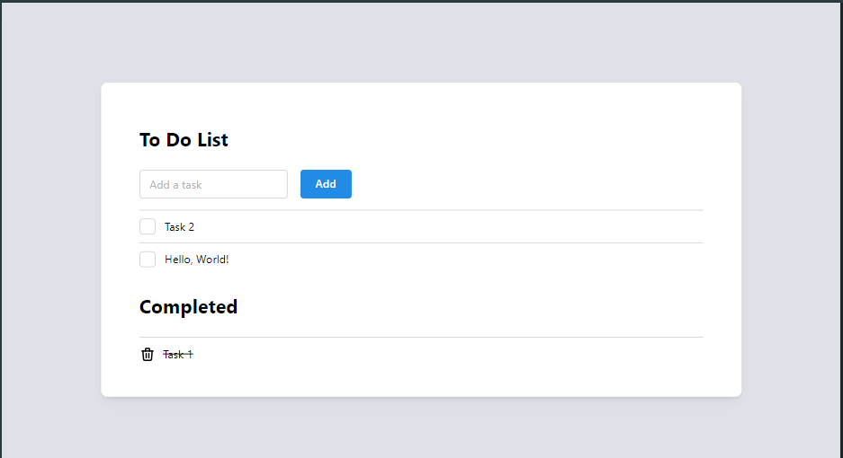

# To-Do List

After learning some TypeScript and Spring Boot, I wanted to get some hands-on experience with them, so I decided to make this simple to-do list as my first independent project. For the database, I used a local MySQL server.

## Features

This to-do list features all four CRUD operations:
1. Create - adding a task to the list.
2. Read - retrieves all tasks on initial render, then tasks are separated by their completion statuses client-side.
3. Update - marking the task as done updates its status.
4. Delete - completed tasks can be deleted.

## Credits

For the frontend, I used the [Mantine](https://mantine.dev/) component library and [Tabular icons](https://tabler.io/icons) for the icon.

## License

This project is licensed under the MIT License.